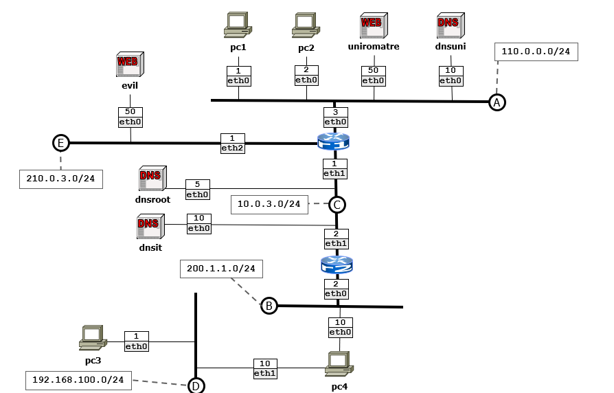
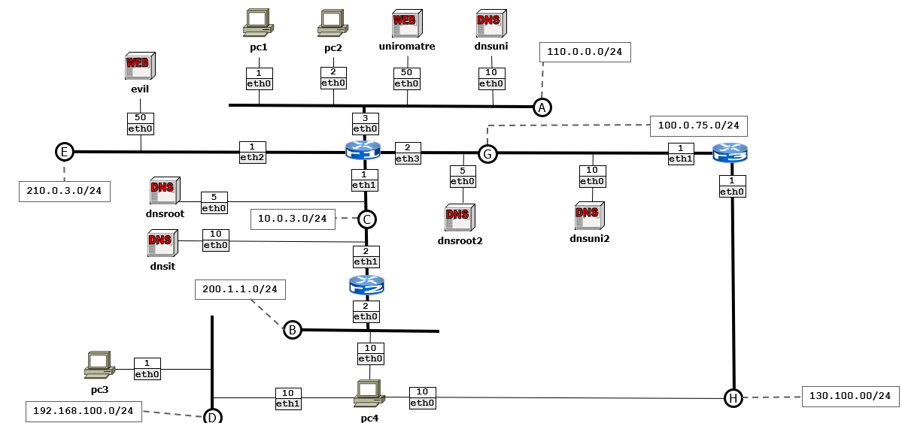

# DNS Security: From Exploitation to Enterprise Protection
This repository presents a comprehensive study on DNS security. The project is divided into three progressive scenarios that evolve a standard network into a secure, redundant environment.

## Scenario 1: Man-in-the-Middle Attack and Credential Harvesting
The first scenario demonstrates the fundamental vulnerability of the Domain Name System: the lack of origin authenticity. In a standard DNS exchange, a client or resolver accepts the first response that matches the query ID, regardless of its source.
### Topology Overview
The network consists of a University LAN (A) containing the legitimate web portal and DNS server, an intermediate backbone, and a remote User LAN (D) connected via a resolver.

### Execution of the Attack
The attack is performed at the routing level on node r2. It combines traffic manipulation and packet injection:
Traffic Interference: To ensure the victim accepts the forged response, legitimate traffic from the university DNS server is suppressed using firewall rules on the gateway.

<pre> 
    iptables -A FORWARD -d 110.0.0.10 -p udp --dport 53 -j DROP 
</pre>
    
Packet Injection: A sniffing engine monitors the network for queries directed to uniroma3.it. Upon detection, it instantly generates a forged DNS response. The response "steals" the identity of the legitimate server by spoofing its source IP and matching the original transaction ID.
<pre>
    ether_layer = Ether(dst=pkt[Ether].src, src=pkt[Ether].dst)

    ip_layer = IP(src=pkt[IP].dst, dst=pkt[IP].src)

    udp_layer = UDP(sport=pkt[UDP].dport, dport=pkt[UDP].sport)

    dns_layer = DNS(id=pkt[DNS].id, qr=1, aa=1, qd=pkt[DNS].qd, an=DNSRR(rrname=qname, type='A', rdata="210.0.3.50"))
</pre>
    
Phishing Logic: The victim is redirected to a malicious "Evil" server. This server hosts a clone of the student portal. When the user enters their credentials, a PHP backend logs the data and performs a seamless Auto-POST redirection to the real university portal. This ensures the user remains unaware of the compromise.

## Scenario 2: Defense via DNSSEC Implementation
The second scenario introduces DNS Security Extensions (DNSSEC) to mitigate spoofing attacks through cryptographic validation.
### The Chain of Trust
Integrity is guaranteed by signing DNS zones with a hierarchy of keys. Each zone provides a "proof of origin" to its parent:
- Root Zone (.): Signed by the Root Authority.
- IT Zone (.it): Its public key is hashed and stored in the Root zone as a DS (Delegation Signer) record.
- University Zone (uniroma3.it): Its public key is hashed and stored in the IT zone.
### Validating Resolver Mechanism
The resolver pc4 is configured with a Trust Anchor, which is the public key of the Root server.
<pre>

    trust-anchors {
        "." static-key 257 3 13 "wu8ma9EvxFhISJabP7+JOBwn/geejdepyV4WVi5Uv0Tn80KNQfpAuDeNhKEunT5pmUXjIx/rkdOiK/xApdQNEg==";
    };
</pre>
When a response is received, the resolver verifies the digital signature (RRSIG) using the corresponding DNSKEY. It follows the chain up to the trust anchor.
### Impact on the Attack
When the attacker attempts to inject a forged IP address, they cannot produce a valid cryptographic signature for that record. The resolver detects the signature mismatch and discards the response, returning a SERVFAIL to the user's browser, effectively blocking the phishing attempt.

## Scenario 3: Enterprise Redundancy and High Availability
The final scenario focuses on infrastructure resilience, ensuring that security policies (DNSSEC) remain active even during hardware or link failures.
### Topology Evolution
The backbone is expanded with a secondary path (LAN G) and an additional router (r3). Backup DNS authorities are introduced for both the Root and the University domains.

### High Availability Features
DNS Master/Slave Synchronization: Secondary servers (dnsroot2 and dnsuni2) are configured as slaves. They maintain an exact copy of the signed zones through automated Zone Transfers.
<pre>
    zone "uniroma3.it" {
        type slave;
        file "/var/cache/bind/db.uniroma3.transfered";
        masters { 110.0.0.10; };
    };
</pre>
Master Propagation: The master server uses the NOTIFY protocol to alert slaves of any updates, trig
<pre>
    allow-transfer { 100.0.75.10; };
    also-notify { 100.0.75.10; };
</pre>

Routing Failover: Static routes and redundant backbone connections ensure that if the primary path through r1-r2 is interrupted, the resolver can still reach the slave authorities through the secondary path via r3.

## Laboratory Environment
### Core Components
BIND9: Used for all DNS authorities and the recursive validating resolver.
Apache2/PHP: Used for both the legitimate university portal and the phishing site.
Scapy: Used for custom packet crafting and network injection.
Kathara: Virtualization engine for node and collision domain management.

### Monitoring
Traffic analysis is conducted via a containerized Wireshark instance. It allows for the observation of DNSSEC flags (DO bit) and the verification of the AD (Authenticated Data) flag in successful secure resolutions.

## Credits
This project is based on the educational materials from Roma Tre University (Computer Networks Research Group).
- Course: Computer science engineering - Roma Tre University
- Original Content: D. Villa
